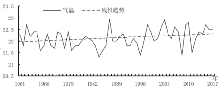
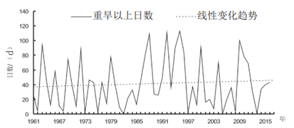
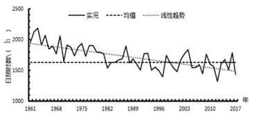

Jinquan Ye, Jiangzhou Wang, Jiaer Pan, Kaidi Liu

**Introduction**

Baise, strategically situated in the upper reaches of the Youjiang River valley in western Guangxi, functions as a crucial corridor, the "Golden Corridor," facilitating connectivity between China's expansive Southwest and the Pacific Ocean. The region's subtropical monsoon climate yields an average annual temperature of 22.1°C, precipitation amounting to 1067mm, and substantial sunshine, accruing 1633 hours annually. Characterized by hot summers and warm winters, Baise's climate exemplifies a synchrony of rainfall and heat, integral to its ecological rhythm.

In recent years, capitalizing on its strategic geographical positioning — bridging the Southwest and the Pearl River Delta while orienting towards the ASEAN — Baise has experienced significant economic growth. This economic progress is pivotal, accentuating the city's evolving stature and its capacity to undertake and sustain environmental and climate-related initiatives. As a prominent forest area and ecological protection zone in the Pearl River's upper catchment, Baise stands as a vital exemplar for ecological civilization initiatives.

Urban planning in Baise ambitiously aims at evolving into an ecologically sustainable city, with an emphasis on fostering a climate-conducive environment. The scholarly discourse on climate change, particularly its impacts on ecological and socio-economic frameworks, is extensive, advocating for adaptive strategies to mitigate climate change. The global warming backdrop amplifies these discussions, underscoring the urgency for cities to synchronize their developmental endeavors with their climatic capacities.

Despite the robust discourse, a noticeable deficiency exists in Baise's climate adaptability policies. The city's economic ascent lays a fertile foundation for the formulation and implementation of nuanced, impactful climate adaptation strategies. Yet, a discernible paucity of comprehensive policy frameworks addressing this exigency is evident. Thus, the primary aim of this policy recommendation paper is to articulate more profound policy measures and to delve into the benefits these policies could engender. By addressing the identified gaps in Baise's climate adaptability strategies, this paper seeks to forge and implement a suite of actionable policies, ensuring the city's economic growth harmonizes with ecological equilibrium. These proposed policies are designed to enhance Baise's climatic resilience, fostering sustainable development economically and environmentally. Through the enactment of these policies, Baise will not only navigate current and future climatic challenges but will also solidify and elevate its stature as a beacon of ecological civilization. Our objective is to assist Baise in constructing a more resilient and sustainable future, providing its inhabitants with a more habitable and prosperous environment through these policy recommendations.

**Scientific Facts**

This study utilizes observational data on temperature, precipitation, and sunshine from the Baise National Meteorological Observation Station spanning from 1961 to 2017, along with daily Comprehensive Meteorological Drought Index data from 1961 to 2016. The linear trend method was employed to ascertain climatic change trends, with changes deemed significant if they passed the significance test at a confidence level above 90%. The computation of the Comprehensive Meteorological Drought Index and the classification of drought levels are in accordance with the national standard (GB/T 20481-2006). The term "high-temperature days" refers to days when the maximum temperature reached or exceeded 35°C, while "heavy rainfall days" denotes days with rainfall of 50mm or more. The long-term average refers to the mean values from 1981 to 2010.

**Temperature**\
Between 1961 and 2017, Baise experienced a significant upward trend in annual average [temperature](<>) (Figure 1), with a warming rate of 0.06°C per decade, which is lower than the average warming rate for Guangxi (0.15°C per decade). Over these 57 years, the annual average temperature in Baise exhibited a fluctuating increase, with noticeable interannual and interdecadal variations. The period before the mid-1990s was relatively stable and cooler, whereas the post-late 1990s period transitioned into a warmer phase, marked by significant warming. Specifically, the average temperature from 1998 to 2017 was 0.34°C higher than that from 1961 to 1997. After 1998, only the years 2008 and 2011 recorded significantly lower temperatures.

The annual average minimum temperature in Baise showed a clear rising trend, increasing by an average of 0.14°C every decade. The interdecadal variations in the annual average minimum temperature were similar to those in the annual average temperature, with significant warming observed after the late 1990s. The average minimum temperature from 1997 to 2017 was 0.54°C higher than that from 1961 to 1996. Among the 57 years, the 12 highest average minimum temperature years all occurred after 1996, with 2017 recording the highest annual average minimum temperature of 19.5°C since 1961.

Figure 1

**High Frequency of Drought**

Figure 2

Baise experiences a high frequency of drought occurrences, with varying degrees of drought almost every year during the winter and spring seasons, making it one of the cities (or counties) with the most severe drought conditions in Guangxi. On average, there are 45 days per year with severe drought or worse. Over the past 60 years, the trend in the number of days with severe drought or worse in Baise has not been clear, showing interannual and interdecadal fluctuations (Figure 2).

**Significant Reduction in Annual Sunshine Duration**

From 1961 to 2017, the annual sunshine duration in Baise showed a significant decreasing trend (Figure 3), with an average reduction of 81 hours per decade. The decrease in sunshine duration was significant across all four seasons, with decadal reduction rates of 21 hours, 26 hours, 19 hours, and 13 hours, respectively. Overall, the annual sunshine duration demonstrated a fluctuating downward trend. The period before the 1990s experienced relatively higher sunshine durations, whereas the period post-1990s entered a phase of reduced sunshine. Notably, the year 2012 recorded the lowest annual sunshine duration since 1961, with 307 hours less than the long-term average.

<!--\\[if gte vml 1]><v:shape
 id="图片_x0020_1" o:spid="_x0000_i1025" type="#_x0000_t75" style='width:280.2pt;
 height:123.6pt;visibility:visible;mso-wrap-style:square'>
 <v:imagedata src="file:///C:/Users/JINQUA~1/AppData/Local/Temp/msohtmlclip1/01/clip_image007.png"
  o:title=""/>
</v:shape><!\\[endif]-->

<!--\\[if !vml]-->

<!--\\[endif]-->

Figure 3

**Future Climate Change Projections for Baise**

The climate change monitoring data from the past nearly 60 years indicate that Baise has undergone warming changes consistent with the broader trends observed in Guangxi and globally, with higher frequencies of high temperatures and droughts. Based on predictions from the "China Regional Climate Change Projection Dataset Version 2.0," under a medium greenhouse gas emissions scenario, Baise's temperature is expected to continue rising towards 2050, with a trend towards reduced precipitation. The climate in Baise is projected to become warmer, and the dichotomy in precipitation extremes may intensify, meaning that both droughts and intense rainfall could become more severe. An increase in hot weather days and more frequent torrential rain and flooding events will pose greater demands on the city's adaptability to climate change.

**Comparative advantages of current policies**

The newly proposed climate adaptability policies for Baise City, focusing on the integration of Green Infrastructure (GI) and Blue Infrastructure (BI), offer a range of benefits over the previous approaches as outlined in the 2018 policy directive.

Effectiveness: By giving utmost priority to the integration of green infrastructure (GI) and blue infrastructure (BI), policies aimed at addressing climate change's pressing challenges have been implemented. This approach is effective because it acknowledges and uses natural elements to combat specific climate change-related threats. The utilization of GI and BI provides a targeted solution combating threats such as heatwaves and flooding, making it distinct from previously implemented policies offering more generalized solutions. Green infrastructure focuses on environmentally-based adaptations designed to foster the environment's natural resources, boosting landscape ecological systems' functioning through sustainable management. A good example of GI is urban forests that provide myriad ecosystem services that significantly help mitigate the effects of climate change. Trees trap carbon dioxide, reducing atmospheric heat, and clean the air by absorbing and filtering pollutants. They also regulate the water cycle by cleaning and releasing it back into the environment via transpiration. Another valuable component of this approach is blue infrastructure. Blue infrastructure represents ecologically sensitive systems for water management. It mimics, maintains, and restores natural water cycles, increasing the number of water bodies such as rivers, lakes, wetlands, and groundwater systems within urban developments. The evidence shows that this type of infrastructure provides positive impacts on the surrounding communities. By targeting climate-related threats at a local level, cities can use blue and green infrastructure together effectively to address climate change, combined with other policy measures, such as regulations or economic incentives. By incorporating GI and BI into climate change adaptation policies, the approach can better recognize the natural systems' value in delivering tangible and cost-effective solutions to mitigate the risks of flooding, heatwaves, and other weather events. The continued incorporation of GI and BI should be an integral part of climate adaptation planning at the local level as they offer a practical way to adapt sustainably while improving the community's quality of life.

Efficiency: The integration of GI and BI not only enhances the effectiveness of climate adaptation measures but also promotes efficiency in resource allocation. By leveraging natural solutions like green spaces and water bodies, the city can achieve multiple objectives simultaneously, such as reducing urban heat island effects, managing stormwater, and enhancing overall urban resilience. This multi-functional approach optimizes the use of limited resources, maximizing the city's capacity to adapt to climate change while minimizing costs and potential redundancies.

Fairness: Adopting policies that prioritize GI and BI contributes to greater equity and social justice within the community. Green spaces provide numerous benefits beyond climate adaptation, including improved air quality, enhanced biodiversity, and opportunities for recreation and social interaction. By ensuring equitable access to these amenities across different neighborhoods, the city promotes environmental justice and enhances the well-being of all residents, regardless of socioeconomic status. Similarly, BI initiatives, such as sustainable stormwater management, can help mitigate the disproportionate impacts of flooding on vulnerable populations, further promoting fairness and resilience across the city.

Appropriateness: The proposed focus on GI and BI represents a contextually appropriate response to the unique environmental and socio-economic characteristics of Baise City. Recognizing the city's geographical features, climate vulnerabilities, and developmental priorities, these policies offer tailored solutions that resonate with the local context. By building upon existing ecological assets and integrating them into urban planning processes, the city ensures that its climate adaptation strategies are both effective and culturally relevant. Moreover, by engaging local stakeholders in the design and implementation of GI and BI projects, the policies foster a sense of ownership and empowerment within the community, reinforcing their appropriateness and long-term sustainability.

The integration of BI and GI into Blue-Green Infrastructure (BGI) represents a holistic approach to urban planning that was lacking in the previous policy. BGI not only addresses heat mitigation and stormwater management concurrently but also offers multifunctional benefits, ensuring a systematic approach to mitigating air temperatures and flooding risks. This integrated approach marks a significant shift from the previous policy’s more segmented focus on urban resilience without a clear strategy for ecological integration.

Furthermore, the new policy's emphasis on policy support to formalize the role of BGI as critical infrastructure demonstrates a forward-thinking approach to urban planning. By ensuring the maintenance and resilience of BGI based on ecological principles, the policy underscores the importance of protecting and restoring natural areas. This aspect represents an advancement over the older policy, which, while aiming for ecological resilience, lacked a clear mandate for integrating green and blue infrastructure into the city’s fabric.

In summary, the shift towards a more integrated, nature-based approach to climate adaptability in Baise City’s new policies not only addresses specific urban challenges such as heatwaves and flooding but also promotes a sustainable, livable, and resilient urban environment. This approach represents a significant evolution from the previous strategies, focusing on a broader, less defined goal of urban resilience without the explicit incorporation of natural infrastructure solutions.

<!--EndFragment-->