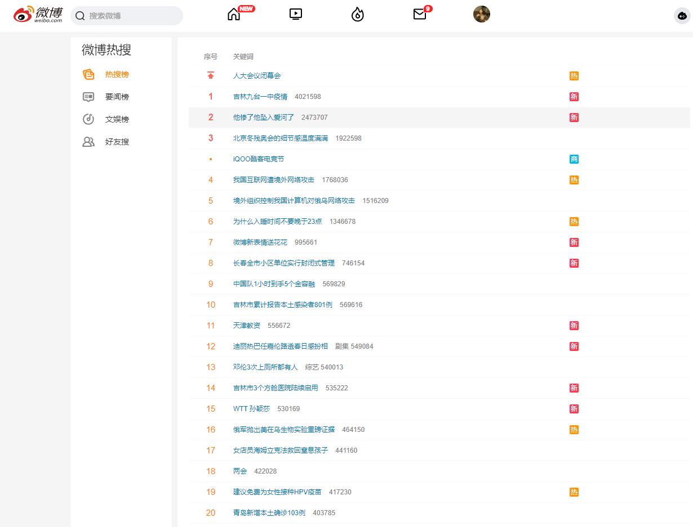

#### The Weibo search page is shown below, and it takes only two steps to crawl all the search contents under a keyword.

* Login to your Weibo account and go to the [home page of Weibo](https://weibo.com/).



* Go to the Check page（检查） and click on Network（网络）. Select weibo.com to see the cookie column, double click to copy the cookie. Use the "pip install lxml" command to install the lxml package to run the following code.

  

```
# -*- coding: utf-8 -*-
"""
Created on Tue Jun  9 16:31:15 2020

@author: User
"""

import requests
from lxml import etree
import re
import time
import random
import pandas as pd
import csv
import calendar as cal
import datetime
def get_html(url,cookies):
    try:
        cookie_dict = {i.split("=")[0]: i.split("=")[-1] for i in cookies.split("; ")}
        headers = {
            'Connection': 'keep-alive',
            'Pragma': 'no-cache',
            'Cache-Control': 'no-cache',
            'Upgrade-Insecure-Requests': '1',
            'User-Agent': 'Mozilla/5.0 (Windows NT 10.0; Win64; x64) AppleWebKit/537.36 (KHTML, like Gecko) Chrome/70.0.3538.67 Safari/537.36',
            'Accept': 'text/html,application/xhtml+xml,application/xml;q=0.9,image/webp,image/apng,*/*;q=0.8',
            'Accept-Encoding': 'gzip, deflate, br',
            'Accept-Language': 'zh-CN,zh;q=0.9,zh-TW;q=0.8',
        }
        response = requests.get(url, headers=headers,cookies=cookie_dict)
        html=response.text
        #print(html)
        return html
    except Exception as e:
        print(e)
        print(url)
        time.sleep(random.uniform(6,15))
def get_infos(html,url):
    try:
        html = etree.HTML(html)
        xinxis = html.xpath('//div[@action-type="feed_list_item"]')
        infos=[]
        for xinxi in xinxis:
            ceshi1 = xinxi.xpath('string(.//div[@class="card-comment"])')
            ceshi2 = xinxi.xpath('string(.//p[@node-type="feed_list_content_full"])')
            if len(ceshi1) == 0:
                if len(ceshi2) == 0:
                    txt = xinxi.xpath('string(.//p[@node-type="feed_list_content"])')
                else:
                    txt = ceshi2.replace('收起全文d', '')
                name = xinxi.xpath('string(.//div[@class="info"]//a[@class="name"])')
                shuju = xinxi.xpath('string(.//div[@class="card-act"])').replace('\xa0', '').replace(' ', '').replace(
                    '\u3000', '').replace('\n', '-').replace('\r', '').replace('\t', '')
                a1 = xinxi.xpath('string(.//p[@class="from"]/a[1])').replace('\xa0', '').replace(' ', '').replace(
                    '\u3000', '').replace('\n', '').replace('\r', '').replace('\t', '')
                a2 = xinxi.xpath('string(.//p[@class="from"]/a[2])').replace('\xa0', '').replace(' ', '').replace(
                    '\u3000', '').replace('\n', '').replace('\r', '').replace('\t', '')
                a3 = xinxi.xpath('string(.//p[@class="from"]/a[3])').replace('\xa0', '').replace(' ', '').replace(
                    '\u3000', '').replace('\n', '').replace('\r', '').replace('\t', '')
                if '来自' in a1:
                    shijian = a2
                    shebei = a3
                else:
                    shijian = a1
                    shebei = a2
                lianjie = 'https:' + xinxi.xpath('string(.//p[@class="from"]/a/@href)')
                tus = []
                ts = xinxi.xpath('.//div[@class="media media-piclist"]//li[*]')
                for tt in ts:
                    tu = 'https:' + tt.xpath('string(./img/@src)').replace('thumb150', 'bmiddle')
                    tus.append(tu)
                data = {
                    '0':url,
                    #'1': lianjie,
                    #'2': name,
                    '3': txt.replace('\xa0', '').replace(' ', '').replace(
                    '\u3000', '').replace('\n', '').replace('\r', '').replace('\t', '').replace('\u200b',''),
                    #'4': shuju,
                    '5': shijian,
                    #'6': shebei,
                    #'7': tus
                }
                data1 = {
                    #'1': lianjie,
                    #'2': name,
                    '3': txt.replace('\xa0', '').replace(' ', '').replace(
                    '\u3000', '').replace('\n', '').replace('\r', '').replace('\t', '').replace('\u200b',''),
                    #'4': shuju,
                    '5': shijian,
                    #'6': shebei,
                    #'7': tus
                }
                infos.append(data1)
        xiayiye=html.xpath('string(//div[@class="m-page"])')
        aaa = pd.DataFrame.from_dict(infos)
        aaa.to_csv('电信诈骗21-06-21.csv', mode='a', encoding='utf-8-sig', header=False, index=False)
        return xiayiye
    except Exception as e:
        print(e)
def main():
    cookies=input('按视频教程复制粘贴登录信息后按enter')
    count=0
    datestart = input('请输入起始日期，格式为2020-01-01')
    dateend = input('请输入结束日期，格式为2020-01-01')
    # 转为日期格式
    kw=input('请输入搜索关键词')
    search_type=input('请输入搜索模式:综合模式输入typeall=1,热搜输入xsort=hot,原创输入scope=ori')
    datestart = datetime.datetime.strptime(datestart, '%Y-%m-%d')
    dateend = datetime.datetime.strptime(dateend, '%Y-%m-%d')
    date_list = []
    date_list.append(datestart.strftime('%Y-%m-%d'))
    while datestart < dateend:
        datestart += datetime.timedelta(days=+1)
        # 日期转字符串存入列表
        ceshi = datestart.strftime('%Y-%m-%d')
        date_list.append(ceshi)
    for date in date_list[:-1]:
        start = date
        end = date_list[date_list.index(date) + 1]
        urls=['https://s.weibo.com/weibo?q='+str(kw)+'&'+search_type+'&suball=1&timescope=custom:'+start+'-0:'+end+'-0&Refer=g&page={}'.format(i) for i in range(1,51)]
        for url in urls:
            html=get_html(url,cookies)
            if '以下是您可能感兴趣的微博' in html:
                time.sleep(random.uniform(8, 10))
                break
            else:
                time.sleep(random.uniform(8, 10))
                xiayiye=get_infos(html,url)
                if '下一页' in xiayiye:
                    count += 1
                    print(count)
                else:
                    time.sleep(random.uniform(8, 10))
                    break
    time.sleep(random.uniform(1, 2))
if __name__ == '__main__':
    main()


```