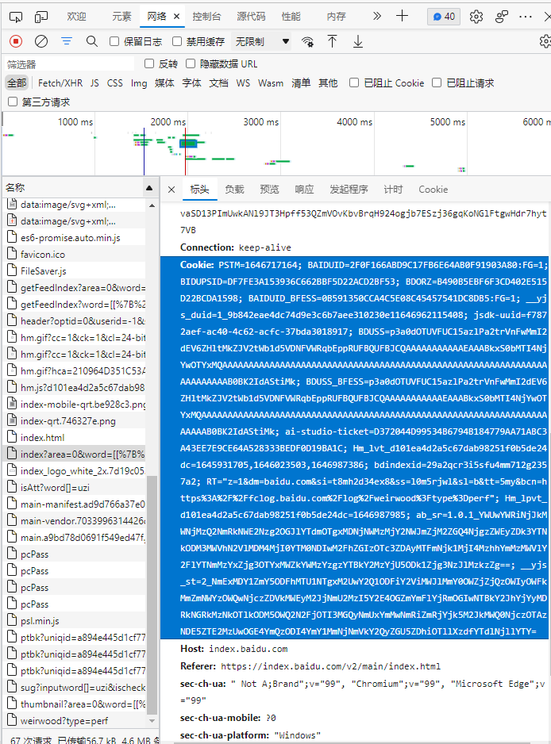

### Login to your Baidu account to get the Baidu index cookie, and obtain it in the following way.



```
PROVINCE_CODE = {'全国': '0','山东': '901', '贵州': '902', '江西': '903', '重庆': '904', '内蒙古': '905', '湖北': '906', '辽宁': '907', '湖南': '908', '福建': '909', '上海': '910', '北京': '911', '广西': '912', '广东': '913', '四川': '914', '云南': '915', '江苏': '916', '浙江': '917', '青海': '918', '宁夏': '919', '河北': '920', '黑龙江': '921', '吉林': '922', '天津': '923', '陕西': '924', '甘肃': '925', '新疆': '926', '河南': '927', '安徽': '928', '山西': '929', '海南': '930', '台湾': '931', '西藏': '932', '香港': '933', '澳门': '934'}

CITY_CODE = {'广州': '95', '深圳': '94', '东莞': '133', '云浮': '195', '佛山': '196', '湛江': '197', '江门': '198', '惠州': '199', '珠海': '200', '韶关': '201', '阳江': '202', '茂名': '203', '潮州': '204', '揭阳': '205', '中山': '207', '清远': '208', '肇庆': '209', '河源': '210', '梅州': '211', '汕头': '212', '汕尾': '213', '郑州': '168', '南阳': '262', '新乡': '263', '开封': '264', '焦作': '265', '平顶山': '266', '许昌': '268', '安阳': '370', '驻马店': '371', '信阳': '373', '鹤壁': '374', '周口': '375', '商丘': '376', '洛阳': '378', '漯河': '379', '濮阳': '380', '三门峡': '381', '济源': '667', '成都': '97', '宜宾': '96', '绵阳': '98', '广元': '99', '遂宁': '100', '巴中': '101', '内江': '102', '泸州': '103', '南充': '104', '德阳': '106', '乐山': '107', '广安': '108', '资阳': '109', '自贡': '111', '攀枝花': '112', '达州': '113', '雅安': '114', '眉山': '291', '甘孜': '417', '阿坝': '457', '凉山': '479', '南京': '125', '苏州': '126', '无锡': '127', '连云港': '156', '淮安': '157', '扬州': '158', '泰州': '159', '盐城': '160', '徐州': '161', '常州': '162', '南通': '163', '镇江': '169', '宿迁': '172', '武汉': '28', '黄石': '30', '荆州': '31', '襄阳': '32', '黄冈': '33', '荆门': '34', '宜昌': '35', '十堰': '36', '随州': '37', '恩施': '38', '鄂州': '39', '咸宁': '40', '孝感': '41', '仙桃': '42', '天门': '73', '潜江': '74', '神农架': '687', '杭州': '138', '丽水': '134', '金华': '135', '温州': '149', '台州': '287', '衢州': '288', '宁波': '289', '绍兴': '303', '嘉兴': '304', '湖州': '305', '舟山': '306', '福州': '50', '莆田': '51', '三明': '52', '龙岩': '53', '厦门': '54', '泉州': '55', '漳州': '56', '宁德': '87', '南平': '253', '哈尔滨': '152', '大庆': '153', '伊春': '295', '大兴安岭': '297', '黑河': '300', '鹤岗': '301', '七台河': '302', '齐齐哈尔': '319', '佳木斯': '320', '牡丹江': '322', '鸡西': '323', '绥化': '324', '双鸭山': '359', '济南': '1', '滨州': '76', '青岛': '77', '烟台': '78', '临沂': '79', '潍坊': '80', '淄博': '81', '东营': '82', '聊城': '83', '菏泽': '84', '枣庄': '85', '德州': '86', '威海': '88', '济宁': '352', '泰安': '353', '莱芜': '356', '日照': '366', '西安': '165', '铜川': '271', '安康': '272', '宝鸡': '273', '商洛': '274', '渭南': '275', '汉中': '276', '咸阳': '277', '榆林': '278', '延安': '401', '石家庄': '141', '衡水': '143', '张家口': '144', '承德': '145', '秦皇岛': '146', '廊坊': '147', '沧州': '148', '保定': '259', '唐山': '261', '邯郸': '292', '邢台': '293', '沈阳': '150', '大连': '29', '盘锦': '151', '鞍山': '215', '朝阳': '216', '锦州': '217', '铁岭': '218', '丹东': '219', '本溪': '220', '营口': '221', '抚顺': '222', '阜新': '223', '辽阳': '224', '葫芦岛': '225', '长春': '154', '四平': '155', '辽源': '191', '松原': '194', '吉林': '270', '通化': '407', '白山': '408', '白城': '410', '延边': '525', '昆明': '117', '玉溪': '123', '楚雄': '124', '大理': '334', '昭通': '335', '红河': '337', '曲靖': '339', '丽江': '342', '临沧': '350', '文山': '437', '保山': '438', '普洱': '666', '西双版纳': '668', '德宏': '669', '怒江': '671', '迪庆': '672', '乌鲁木齐': '467', '石河子': '280', '吐鲁番': '310', '昌吉': '311', '哈密': '312', '阿克苏': '315', '克拉玛依': '317', '博尔塔拉': '318', '阿勒泰': '383', '喀什': '384', '和田': '386', '巴音郭楞': '499', '伊犁': '520', '塔城': '563', '克孜勒苏柯尔克孜': '653', '五家渠': '661', '阿拉尔': '692', '图木舒克': '693', '南宁': '90', '柳州': '89', '桂林': '91', '贺州': '92', '贵港': '93', '玉林': '118', '河池': '119', '北海': '128', '钦州': '129', '防城港': '130', '百色': '131', '梧州': '132', '来宾': '506', '崇左': '665', '太原': '231', '大同': '227', '长治': '228', '忻州': '229', '晋中': '230', '临汾': '232', '运城': '233', '晋城': '234', '朔州': '235', '阳泉': '236', '吕梁': '237', '长沙': '43', '岳阳': '44', '衡阳': '45', '株洲': '46', '湘潭': '47', '益阳': '48', '郴州': '49', '湘西': '65', '娄底': '66', '怀化': '67', '常德': '68', '张家界': '226', '永州': '269', '邵阳': '405', '南昌': '5', '九江': '6', '鹰潭': '7', '抚州': '8', '上饶': '9', '赣州': '10', '吉安': '115', '萍乡': '136', '景德镇': '137', '新余': '246', '宜春': '256', '合肥': '189', '铜陵': '173', '黄山': '174', '池州': '175', '宣城': '176', '巢湖': '177', '淮南': '178', '宿州': '179', '六安': '181', '滁州': '182', '淮北': '183', '阜阳': '184', '马鞍山': '185', '安庆': '186', '蚌埠': '187', '芜湖': '188', '亳州': '391', '呼和浩特': '20', '包头': '13', '鄂尔多斯': '14', '巴彦淖尔': '15', '乌海': '16', '阿拉善盟': '17', '锡林郭勒盟': '19', '赤峰': '21', '通辽': '22', '呼伦贝尔': '25', '乌兰察布': '331', '兴安盟': '333', '兰州': '166', '庆阳': '281', '定西': '282', '武威': '283', '酒泉': '284', '张掖': '285', '嘉峪关': '286', '平凉': '307', '天水': '308', '白银': '309', '金昌': '343', '陇南': '344', '临夏': '346', '甘南': '673', '海口': '239', '万宁': '241', '琼海': '242', '三亚': '243', '儋州': '244', '东方': '456', '五指山': '582', '文昌': '670', '陵水': '674', '澄迈': '675', '乐东': '679', '临高': '680', '定安': '681', '昌江': '683', '屯昌': '684', '保亭': '686', '白沙': '689', '琼中': '690', '贵阳': '2', '黔南': '3', '六盘水': '4', '遵义': '59', '黔东南': '61', '铜仁': '422', '安顺': '424', '毕节': '426', '黔西南': '588', '银川': '140', '吴忠': '395', '固原': '396', '石嘴山': '472', '中卫': '480', '西宁': '139', '海西': '608', '海东': '652', '玉树': '659', '海南': '676', '海北': '682', '黄南': '685', '果洛': '688', '拉萨': '466', '日喀则': '516', '那曲': '655', '林芝': '656', '山南': '677', '昌都': '678', '阿里': '691'}

import datetime
import time
import requests
import execjs
import pandas as pd
from pandas.core.frame import DataFrame

finaldata=DataFrame()

# 搜索指数数据解密
def decryption(keys, data):
    dec_dict = {}
    for j in range(len(keys) // 2):
        dec_dict[keys[j]] = keys[len(keys) // 2 + j]

    dec_data = ''
    for k in range(len(data)):
        dec_data += dec_dict[data[k]]
    return dec_data

for i in PROVINCE_CODE:
    print(PROVINCE_CODE[i]+i)
    dname=i
    if __name__ == "__main__":
        scenicName = '气候变化'
    #下面这句话的最后一部分是调整天数的！！！days=30 直接改就行！！！！！！！
        dataUrl = 'https://index.baidu.com/api/SearchApi/index?area='+PROVINCE_CODE[i]+'&word=[[%7B%22name%22:%22' + scenicName + '%22,%22wordType%22:1%7D]]&days=30'
        keyUrl = 'https://index.baidu.com/Interface/ptbk?uniqid='
        header = {
            'Accept': 'application/json, text/plain, */*',
            'Accept-Encoding': 'gzip, deflate, br',
            'Accept-Language': 'zh-CN,zh;q=0.9',
            'Connection': 'keep-alive',
    #这个cookie要改！！！！有可能会失效
            'Cookie': 'BIDUPSID=DF7FE3A153936C662BBF5D22ACD2BF53; PSTM=1607827553; __yjs_duid=1_a99c866c16a381d9728d229a8295137d1625500484070; MCITY=-%3A; BDUSS=1E5NnJxZFh6Mm1ORXB1Wn4yd3Q3dTB6T2ZsMW04cWFUNC1RWlVkMjhtR1VTOVJoSVFBQUFBJCQAAAAAAAAAAAEAAABkxS0bMTI4NjYwOTYxMQAAAAAAAAAAAAAAAAAAAAAAAAAAAAAAAAAAAAAAAAAAAAAAAAAAAAAAAAAAAAAAAAAAAAAAAJS-rGGUvqxhR; BDUSS_BFESS=1E5NnJxZFh6Mm1ORXB1Wn4yd3Q3dTB6T2ZsMW04cWFUNC1RWlVkMjhtR1VTOVJoSVFBQUFBJCQAAAAAAAAAAAEAAABkxS0bMTI4NjYwOTYxMQAAAAAAAAAAAAAAAAAAAAAAAAAAAAAAAAAAAAAAAAAAAAAAAAAAAAAAAAAAAAAAAAAAAAAAAJS-rGGUvqxhR; BAIDUID=578F7FF1669915B14C34456267619A87:FG=1; BAIDUID_BFESS=578F7FF1669915B14C34456267619A87:FG=1; jsdk-uuid=27eb31c8-8eee-4b9b-95c4-7e24e1b9bc1a; bdindexid=74iiga9tjj0cc9rvrkauee0fm5; BDORZ=B490B5EBF6F3CD402E515D22BCDA1598; BDRCVFR[feWj1Vr5u3D]=I67x6TjHwwYf0; delPer=0; PSINO=7; H_PS_PSSID=34447_35296_35106_31660_35435_34584_35491_35234_35320_26350; Hm_lvt_d101ea4d2a5c67dab98251f0b5de24dc=1638710878,1640008082,1640068482; Hm_lpvt_d101ea4d2a5c67dab98251f0b5de24dc=1640073088; ab_sr=1.0.1_NTEzYTU1NGNlZDc0ODQ0ZTE1NTFmNDE5MDY0M2Q2YzdmMzRmMjBlODZhYmU3ZTRmODc0YzU3ODA0ODU2OGViODYwMzU1MmRhZjkwODMwMjhjOTUyNmZlYTdhNjg1NTUzZTY0ZTA2ODVlNTA2MWEyNzFkMGJiZDM5NjkwOGQ1YTg1MDJkYWViZGYyMjk4Mzc4MzU0YmE4M2Q4OTdjOGFiZA==; __yjs_st=2_Zjc0MjJhZjBhZWU3MGNjZDlhMzAzZTVkNWEyMjhjNGMzYzBiMzNhN2UzMjlhMGZlZDE1MDFlMWIzNTM3OGQwMWU0ZWYyZjkwMDZmNjcwMGY2MzYwMjQ3ZGFkNWZhYTM3OTU3OWNmMjk2OWVjMmQ5NWRlMDJhMzE4MjQ4YWJlMzRjNDJjM2U0NDllMGFjNjgyNzUxZDI0MzhjN2Y1OThlY2I1N2M0MDA2YjA1Y2RkNTU4ZTMwNzY1NDk0MzE5N2Q0MDgyMThlMmFmYzc4ZjIyZWEwNDM1ZmJiMjJjMDVjZWNlZTc3MGVjOTAyNTkzZDA0YWI0ZDlmYWRiYTUyMGU3Y183XzNmOTA0YTI3; RT="z=1&dm=baidu.com&si=b1i1yeo66le&ss=kxft2dsd&sl=2&tt=1jr&bcn=https%3A%2F%2Ffclog.baidu.com%2Flog%2Fweirwood%3Ftype%3Dperf&ld=3tzn"',
            'Host': 'index.baidu.com',
            'Referer': 'https://index.baidu.com/v2/main/index.html',
            'sec-ch-ua': '" Not;A Brand";v="99", "Google Chrome";v="91", "Chromium";v="91"',
            'sec-ch-ua-mobile': '?0',
            'Sec-Fetch-Dest': 'empty',
            'Sec-Fetch-Mode': 'cors',
            'Sec-Fetch-Site': 'same-origin',
            'User-Agent': 'Mozilla/5.0 (Windows NT 10.0; Win64; x64) AppleWebKit/537.36 (KHTML, like Gecko) Chrome/91.0.4472.77 Safari/537.36'
        }
        # 设置请求超时时间为30秒
        resData = requests.get(dataUrl, timeout=30, headers=header)

        uniqid = resData.json()['data']['uniqid']
        print("uniqid:{}".format(uniqid))
        keyData = requests.get(keyUrl + uniqid, timeout=30, headers=header)
        keyData.raise_for_status()
        keyData.encoding = resData.apparent_encoding

        # 开始对json数据进行解析
        startDate = resData.json()['data']['userIndexes'][0]['all']['startDate']
        print("startDate:{}".format(startDate))
        endDate = resData.json()['data']['userIndexes'][0]['all']['endDate']
        print("endDate:{}".format(endDate))
        source = (resData.json()['data']['userIndexes'][0]['all']['data'])  # 原加密数据
        print("原加密数据:{}".format(source))
        key = keyData.json()['data']  # 密钥
        print("密钥:{}".format(key))

        # Python的强大之处就在于，拥有很强大的第三方库，可以直接执行js代码，即对解密算法不熟悉，无法转换为Python代码时，直接执行js代码即可
        # js = execjs.compile('''
        #         function decryption(t, e){
        #             for(var a=t.split(""),i=e.split(""),n={},s=[],o=0;o<a.length/2;o++)
        #                 n[a[o]]=a[a.length/2+o]
        #             for(var r=0;r<e.length;r++)
        #                 s.push(n[i[r]])
        #             return s.join("")
        #         }
        # ''')
        # res = js.call('decryption', key, source)  # 调用此方式解密，需要打开上面的注解

        res = decryption(key, source)
        # print(type(res))
        resArr = res.split(",")

        dateStart = datetime.datetime.strptime(startDate, '%Y-%m-%d')
        dateEnd = datetime.datetime.strptime(endDate, '%Y-%m-%d')
        dataLs = []
        while dateStart <= dateEnd:
            dataLs.append(str(dateStart))
            dateStart += datetime.timedelta(days=1)
            # print(dateStart.strftime('%Y-%m-%d'))
        time.sleep(2)
        ls = []
        for i in range(len(dataLs)):
            ls.append([scenicName, dataLs[i], resArr[i]])

        for i in range(len(ls)):
            print(ls[i])
        n=[]
        t=[]
        for kk in ls:
            t.append(kk[1])
            n.append(kk[2])
        c={"time" : t,dname : n}#将列表a，b转换成字典
        
        excel=DataFrame(c)
        
        finaldata = pd.concat([finaldata,excel],axis=1)
        finaldata = finaldata.iloc[:, ~finaldata.columns.duplicated()]
        time.sleep(2)
finaldata.to_excel("zuizhong.xlsx")    
```